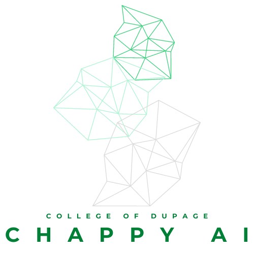

 <div align="center">
  <h1>
   ChappyAI (GPT, Pinecone, Web Scraping)
   </h1>
 </div>

ChappyAI is an intelligent question-and-answer system leveraging state-of-the-art language models and vector search. It utilizes OpenAI's embeddings and Pinecone's vector search to deliver fast and accurate answers.

<div align="center">
  <h2>Talk with Chappy AI: https://chappyai.streamlit.app/</h2>
  <h4> (WARNING: May be down due to Free Tier Inactivity) </h4>
  
</div>

## Table of Contents

- [Introduction](#introduction)
- [Requirements](#requirements)
- [Installation](#installation)
- [Usage](#usage)
- [Contributing](#contributing)
- [License](#license)

## Introduction

ChappyAI is designed to provide efficient retrieval-based question answering by integrating powerful language models with a robust indexing system. The project is modular and built on well-structured components.

## Requirements

- Python 3.7 or higher
- OpenAI API key
- Pinecone API key

## Installation

1. Clone the repository:
   ```bash
   git clone https://github.com/dimitri-sky/ChappyAI.git
   ```

2. Install the required dependencies:
   ```bash
   pip install -r requirements.txt
   ```

3. Set up environment variables for OpenAI and Pinecone API keys.

## Usage

1. Run `app.py` to start the Streamlit server:
   ```bash
   streamlit run app.py
   ```

2. Navigate to the URL provided in the terminal to interact with the ChappyAI interface.

## Contributing

If you would like to contribute to this project, please fork the repository, create a new branch for your feature, and submit a pull request.

## License

This project is licensed under the MIT License. See the [LICENSE](LICENSE) file for details.
